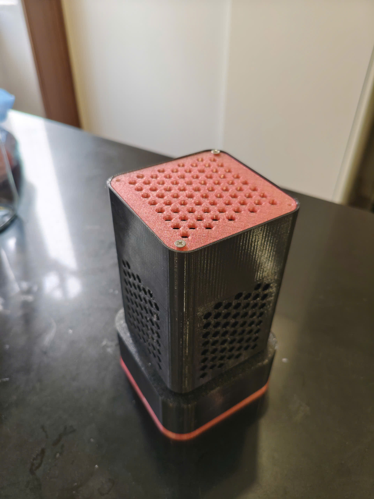

# Máy Lọc Khói Hàn Thông Minh (Smart Welding Fume Extractor)

Hệ thống IoT dùng ESP32 để phát hiện nồng độ khói (MQ-135) và điều khiển quạt hút DC 12V (PWM) qua giao diện web chạy trực tiếp trên ESP32 (Access Point).

***Bản thân là thành viên cùng tạo sản phẩm với quanq026.***
## Tính năng

- Tự động (Auto Mode): Tự động kích hoạt/quyết định tốc độ quạt khi nồng độ khói vượt ngưỡng.
- Thủ công (Manual Mode): Điều chỉnh tốc độ quạt bằng thanh trượt (PWM).
- Giao diện Web: Web server chạy trên ESP32 (AP mode) — truy cập bằng trình duyệt, không cần app.
- Lọc đa tầng: Lọc thô (Polyurethane) + lõi HEPA cho bụi mịn PM2.5.

## Phần cứng (Hardware)

- Vi điều khiển: ESP32 (WiFi tích hợp).
- Cảm biến: MQ-135 (Analog, VOC / khói/gas).
- Động cơ: Quạt hút DC 12V (điều khiển bằng MOSFET N-channel).
- Nguồn: 12V cho quạt; 5V/3.3V cho ESP32 (chia chung mass).
- Mạch công suất: MOSFET + diode/RC snubber nếu cần, và tản nhiệt cho MOSFET.

## Pinout (theo code)

- Quạt (MOSFET gate): GPIO 4 — điều khiển PWM.
- Cảm biến khói (analog): GPIO 34 — đọc ADC.
- LED trạng thái: GPIO 2 — báo hiệu.

> Ghi chú: Luôn nối chung GND giữa nguồn 12V và ESP32. Thêm điện trở kéo, diode bảo vệ nếu cần.

## Cài đặt & Sử dụng

1. Mở file [esp.cpp](esp.cpp#L1) trong Arduino IDE hoặc VS Code + PlatformIO.
2. Chọn board ESP32 tương ứng trong Arduino IDE.
3. Nạp chương trình (Flash) vào ESP32.
4. Sau khi ESP32 khởi động sẽ phát WiFi với:
   - SSID: `ESP32_DieuKhienQuat`
   - Password: `12345678`
5. Kết nối vào mạng AP đó, mở trình duyệt và truy cập `http://192.168.4.1` (mặc định ESP32 AP IP).
6. Giao diện cho phép xem giá trị cảm biến, chuyển chế độ Auto/Manual và điều chỉnh tốc độ quạt.

### Lưu ý khi nạp

- Nếu dùng Arduino IDE, chọn đúng `ESP32 Dev Module` và cổng COM.
- Đảm bảo nguồn 12V đủ dòng cho quạt khi thử nghiệm.

## Giới hạn & An toàn

- MQ-135 có giới hạn: cần hiệu chuẩn với môi trường thực tế; không đặc thù cho mọi loại khói hàn.
- Cẩn thận với nguồn 12V và đấu cơ — tách nguồn, kiểm tra tản nhiệt MOSFET.
- Nên thêm chống nhiễu (RC, LC) để bảo vệ đọc ADC khỏi nhiễu động cơ.

## Hướng phát triển

- Thay/sử dụng cảm biến chuyên dụng cho khí/hạt hàn (VOC/PM chuyên biệt).
- Tích hợp MQTT/HTTP để giám sát từ xa và dashboard tổng hợp.
- Lưu lịch sử đo để phân tích/AI dự đoán thời điểm thay lõi lọc.
- Thêm còi/relay cắt nguồn hoặc cảnh báo khi nồng độ vượt mức nguy hiểm.

---

Tệp chính: [esp.cpp](esp.cpp#L1) — mã nguồn xử lý web server, đọc cảm biến và điều khiển PWM.

Nếu bạn muốn, tôi có thể:
- Thêm hướng dẫn lắp mạch (sơ đồ) và danh sách linh kiện (BOM).
- Chuyển `esp.cpp` sang `main.cpp` và cấu trúc project cho PlatformIO.

---

## Hình ảnh

Ảnh minh họa:
